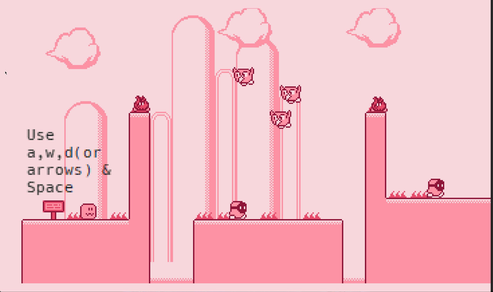

<h1 align="center">
    Kirby Game Clone - Gamedev
</h1>
<p align="center">
    
</p>

<h2 align="center">
    Click <a href="https://julianoventola.github.io/kirb-indie/">here</a> to play - <b>it needs keyboard<b>
</h2>

<p align="center">
  This repository was based on a youtube tutorial, although most of it is the same as the tutorial, I made the first level longer and harder (since there is only one level).
</p>

<p align="center">
<a href="#introduction">Introduction</a> &nbsp;&bull;&nbsp;
<a href="#installation">Installation</a> &nbsp;&bull;&nbsp;
<a href="#usage">Usage</a> &nbsp;&bull;&nbsp;
<a href="#technologies">Technologies</a> &nbsp;&bull;&nbsp;
<a href="#improvements">Improvements</a>
</p>

# Introduction
This <b>kirb game clone</b> has just one level! You can:

- Walk to right - using D or Arrow right
- Walk to left - using A or Arrow left
- Jump - using W or X (You can jump multiple times!)
- Hold and enemy and turn them into stars! - using(and holding) Z or Space bar.
- You have 5 lives, so every time you get hit you will "blink"

## Installation

You need at least Nodejs v20+ to run the game localy

##### git/terminal
```
git clone https://github.com/julianoventola/kirb-indie.git
cd kirb-indie
code .
```
If you don't have vscode the "code ." won't work, just open the folder in your favorite IDE

##### Javascript
```
npm install
npm run dev
```
The game will run in http://localhost:5173/

## Usage
Play the game as much as you want! 😁

## Technologies
- This project was made base on this <a href="https://www.youtube.com/watch?v=R6WvJOiX99s">video</a> 
- Nodejs v20.16.0
- Typescript
- Vite
- Libraries
  - <a href="https://kaboomjs.com/">Kaboomjs</a> 
  - <a href="https://www.npmjs.com/package/gh-pages">gh-pages</a>


## Improvements
 - Create more levels
 - Better UI with "health" and infotips
 - Add sound to game
 - Pressing a key to shoot should be better than holding the key until it shoots
